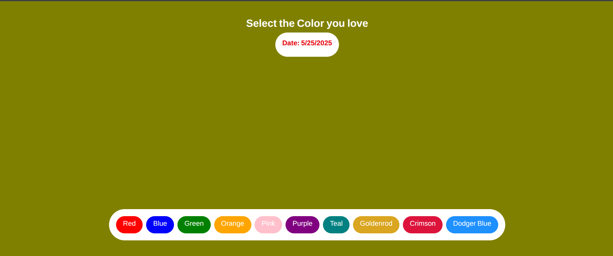

# 🎨 Background Changer App

A simple and responsive React app built with Vite and styled using Tailwind CSS. The app allows users to dynamically change the background color of the page — perfect for learning and experimenting with React state and Tailwind utility classes.

## 🔧 Tech Stack

- ⚛️ [React](https://reactjs.org/)
- ⚡ [Vite](https://vitejs.dev/)
- 💨 [Tailwind CSS](https://tailwindcss.com/)

## 🚀 Features

- Change background color with one click
- Clean and minimal UI
- Mobile-friendly and fast

## 📸 Preview



## 🛠 Installation

Clone the repo and install dependencies:

```bash
git clone https://github.com/abrar-balti/bgchanger.git
cd background-changer-app
npm install
```
